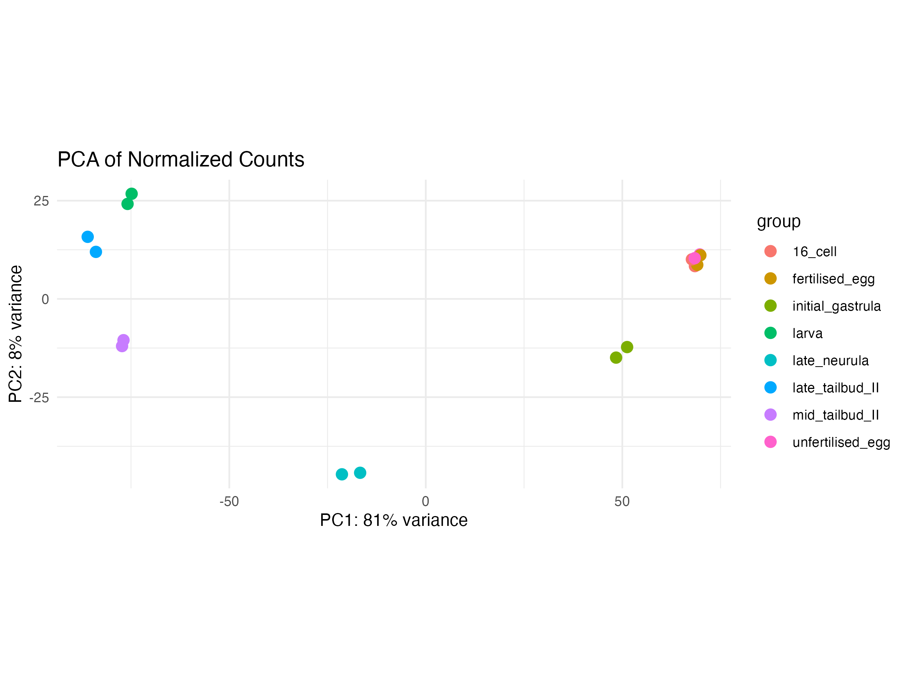
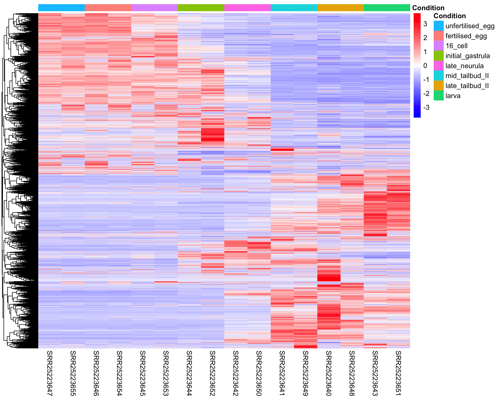
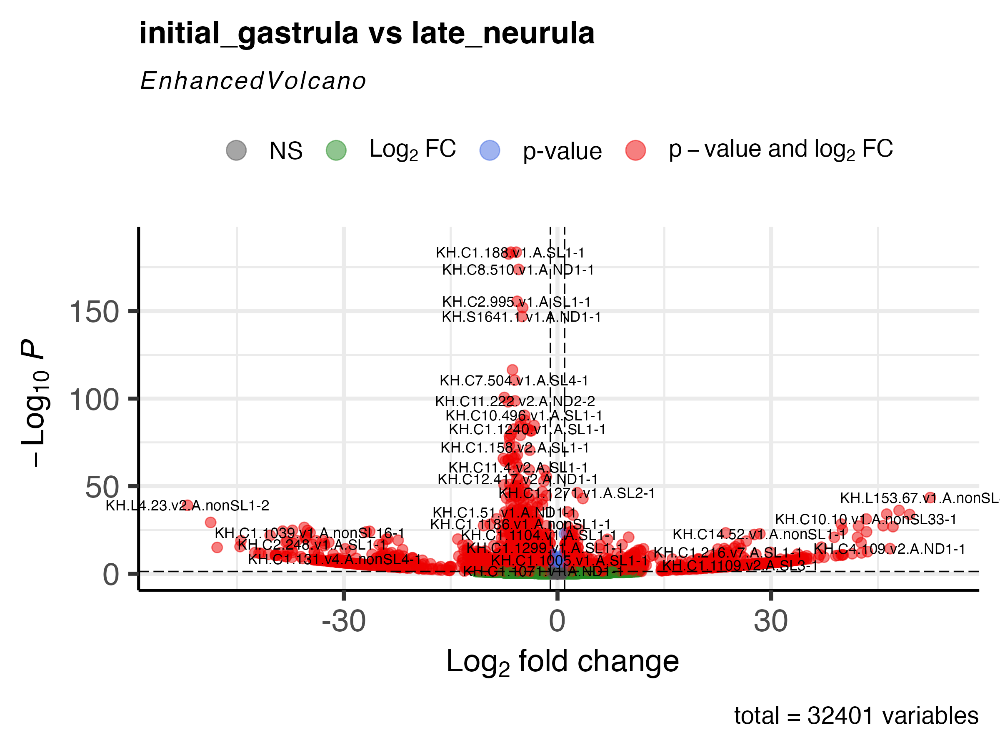
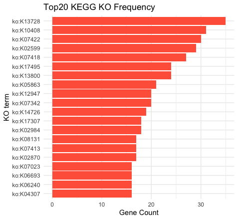
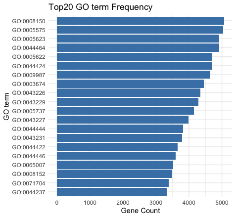

# BIOL_5930_shili

Creat Git account 2025.1.22 \## Reproducibility

### please add a README file that describes: your goals, what naming system and structure you will follow

## Goal:

This study aims to systematically analyze transcriptome data from eight key developmental stages of the model chordate Ciona, to uncover the dynamic changes in gene expression programs throughout embryonic development. The specific objectives are as follows:

1.	Identification of Differentially Expressed Genes (DEGs):
Analyze gene expression changes across different developmental stages of Ciona, identifying genes that are significantly upregulated or downregulated at each stage to uncover key regulatory factors involved in developmental progression.
2.	Functional Enrichment Analysis:
Perform Gene Ontology (GO) annotation and KEGG pathway enrichment analysis on DEGs from each developmental stage, to reveal their functional roles in processes such as cell differentiation, signal transduction, and morphogenesis.
3.	Expression Pattern Clustering:
Apply clustering algorithms (e.g., k-means or hierarchical clustering) to identify gene groups with similar expression trends, construct stage-specific co-expression networks, and explore regulatory modules characteristic of each developmental period.
4.	Transcriptomic Dynamics Across Developmental Stages:
Compare overall gene expression profiles between developmental stages to assess the degree of transcriptional divergence or similarity, providing molecular insights into the conservation and diversification of developmental programs.


## Naming system:

1.  Use English for all names.
2.  Use lowercase letters with words separated by underscores maintain consistency.
3.  Use the YYYY_MM_DD format for chronological sorting.
4.  Use version numbers as \_vX.X (e.g., \_v1.0).)
5.  Ensure folder names clearly reflect the task or project module.
6.  Organize files into a workflow using numbers.

## Structure:

1.  Create a separate top-level folder for each project or task.
2.  Organize subfolders within the project folder based on data, analysis, documents, etc.

For example:

```         
.
├── 01_my_project
│   ├── data
│   │   ├── 00_raw_data.txt
│   │   └── 01_clean_data.txt
│   ├── results
│   │   ├── 02_analysis_report_2025_01_22.pdf
│   │   ├── 03_tSNE.png
│   │   └── 03_volcano_plot_v1.0.pdf
│   └── scripts
│       ├── 01_data_clean.R
│       ├── 02_analysis.R
│       └── 03_plotting.R
└── 02_Other_project

6 directories, 8 files
```

## Data download

```         
fastq-dl -a PRJNA993286 --prefix PRJNA993286 --cpus 16
```

The output is

```         
tree -L 1 
.
├── multiqc_data
├── PRJNA993286.metadata.tsv
├── SRR25223640_1.fastq.gz
├── SRR25223640_2.fastq.gz
├── SRR25223641_1.fastq.gz
├── SRR25223641_2.fastq.gz
├── SRR25223642_1.fastq.gz
├── SRR25223642_2.fastq.gz
├── SRR25223643_1.fastq.gz
├── SRR25223643_2.fastq.gz
├── SRR25223644_1.fastq.gz
├── SRR25223644_2.fastq.gz
├── SRR25223645_1.fastq.gz
├── SRR25223645_2.fastq.gz
├── SRR25223646_1.fastq.gz
├── SRR25223646_2.fastq.gz
├── SRR25223647_1.fastq.gz
├── SRR25223647_2.fastq.gz
├── SRR25223648_1.fastq.gz
├── SRR25223648_2.fastq.gz
├── SRR25223649_1.fastq.gz
├── SRR25223649_2.fastq.gz
├── SRR25223650_1.fastq.gz
├── SRR25223650_2.fastq.gz
├── SRR25223651_1.fastq.gz
├── SRR25223651_2.fastq.gz
├── SRR25223652_1.fastq.gz
├── SRR25223652_2.fastq.gz
├── SRR25223653_1.fastq.gz
├── SRR25223653_2.fastq.gz
├── SRR25223654_1.fastq.gz
├── SRR25223654_2.fastq.gz
├── SRR25223655_1.fastq.gz
└── SRR25223655_2.fastq.gz
```

## quality report generate

```         
cd /data/projects/junhao.chen/shili_homework/01_raw_data
srun --mincpus 40 fastqc -t 40 *gz 
srun --mem 515000 --mincpus 16 fastqc -t 16 *gz
multiqc .
```

## generate mapping command

```         
cd /data/projects/junhao.chen/shili_homework/01_raw_data
ls *gz | sed -r 's/_[12].fastq.gz//' | sort | uniq > ../id
cd /data/projects/junhao.chen/shili_homework/
cat id | while read id; do echo "hisat2 --new-summary --summary-file ${id}.log --threads 20 -x /data/projects/junhao.chen/shili_homework/00ref/Ciona_robusta -1 /data/projects/junhao.chen/shili_homework/01_raw_data/${id}_1.fastq.gz -2 /data/projects/junhao.chen/shili_homework/01_raw_data/${id}_2.fastq.gz | samtools sort -@ 4 -o /data/projects/junhao.chen
/shili_homework/02_hisat2_mapping/${id}.sorted.bam -" ; done > run_hisat2.sh
```

The command looks like:

```         
#!/usr/bin/env bash

#SBATCH --job-name=hisat2
#SBATCH --partition=defq
#SBATCH -n 1
#SBATCH -c 24
#SBATCH --get-user-env
#SBATCH --output=%j.out

export TMPDIR=/data/projects/junhao.chen/shili_homework/tmp/
mkdir -p $TMPDIR
export SAMTOOLS_TMPDIR=$TMPDIR

hisat2 --new-summary --summary-file SRR25223640.log --threads 20 -x /data/projects/junhao.chen/shili_homework/00ref/Ciona_robusta -1 /data/projects/junhao.chen/shili_homework/01_raw_data/SRR25223640_1.fastq.gz -2 /data/projects/junhao.chen/shili_homework/01_raw_data/SRR25223640_2.fastq.gz | samtools sort -@ 4 -T ${TMPDIR}/SRR25223640 -o /data/projects/junhao.chen/shili_homework/02_hisat2_mapping/SRR25223640.sorted.bam -
hisat2 --new-summary --summary-file SRR25223641.log --threads 20 -x /data/projects/junhao.chen/shili_homework/00ref/Ciona_robusta -1 /data/projects/junhao.chen/shili_homework/01_raw_data/SRR25223641_1.fastq.gz -2 /data/projects/junhao.chen/shili_homework/01_raw_data/SRR25223641_2.fastq.gz | samtools sort -@ 4 -T ${TMPDIR}/SRR25223641 -o /data/projects/junhao.chen/shili_homework/02_hisat2_mapping/SRR25223641.sorted.bam -
hisat2 --new-summary --summary-file SRR25223642.log --threads 20 -x /data/projects/junhao.chen/shili_homework/00ref/Ciona_robusta -1 /data/projects/junhao.chen/shili_homework/01_raw_data/SRR25223642_1.fastq.gz -2 /data/projects/junhao.chen/shili_homework/01_raw_data/SRR25223642_2.fastq.gz | samtools sort -@ 4 -T ${TMPDIR}/SRR25223642 -o /data/projects/junhao.chen/shili_homework/02_hisat2_mapping/SRR25223642.sorted.bam -
hisat2 --new-summary --summary-file SRR25223643.log --threads 20 -x /data/projects/junhao.chen/shili_homework/00ref/Ciona_robusta -1 /data/projects/junhao.chen/shili_homework/01_raw_data/SRR25223643_1.fastq.gz -2 /data/projects/junhao.chen/shili_homework/01_raw_data/SRR25223643_2.fastq.gz | samtools sort -@ 4 -T ${TMPDIR}/SRR25223643 -o /data/projects/junhao.chen/shili_homework/02_hisat2_mapping/SRR25223643.sorted.bam -
hisat2 --new-summary --summary-file SRR25223644.log --threads 20 -x /data/projects/junhao.chen/shili_homework/00ref/Ciona_robusta -1 /data/projects/junhao.chen/shili_homework/01_raw_data/SRR25223644_1.fastq.gz -2 /data/projects/junhao.chen/shili_homework/01_raw_data/SRR25223644_2.fastq.gz | samtools sort -@ 4 -T ${TMPDIR}/SRR25223644 -o /data/projects/junhao.chen/shili_homework/02_hisat2_mapping/SRR25223644.sorted.bam -
hisat2 --new-summary --summary-file SRR25223645.log --threads 20 -x /data/projects/junhao.chen/shili_homework/00ref/Ciona_robusta -1 /data/projects/junhao.chen/shili_homework/01_raw_data/SRR25223645_1.fastq.gz -2 /data/projects/junhao.chen/shili_homework/01_raw_data/SRR25223645_2.fastq.gz | samtools sort -@ 4 -T ${TMPDIR}/SRR25223645 -o /data/projects/junhao.chen/shili_homework/02_hisat2_mapping/SRR25223645.sorted.bam -
hisat2 --new-summary --summary-file SRR25223646.log --threads 20 -x /data/projects/junhao.chen/shili_homework/00ref/Ciona_robusta -1 /data/projects/junhao.chen/shili_homework/01_raw_data/SRR25223646_1.fastq.gz -2 /data/projects/junhao.chen/shili_homework/01_raw_data/SRR25223646_2.fastq.gz | samtools sort -@ 4 -T ${TMPDIR}/SRR25223646 -o /data/projects/junhao.chen/shili_homework/02_hisat2_mapping/SRR25223646.sorted.bam -
hisat2 --new-summary --summary-file SRR25223647.log --threads 20 -x /data/projects/junhao.chen/shili_homework/00ref/Ciona_robusta -1 /data/projects/junhao.chen/shili_homework/01_raw_data/SRR25223647_1.fastq.gz -2 /data/projects/junhao.chen/shili_homework/01_raw_data/SRR25223647_2.fastq.gz | samtools sort -@ 4 -T ${TMPDIR}/SRR25223647 -o /data/projects/junhao.chen/shili_homework/02_hisat2_mapping/SRR25223647.sorted.bam -
hisat2 --new-summary --summary-file SRR25223648.log --threads 20 -x /data/projects/junhao.chen/shili_homework/00ref/Ciona_robusta -1 /data/projects/junhao.chen/shili_homework/01_raw_data/SRR25223648_1.fastq.gz -2 /data/projects/junhao.chen/shili_homework/01_raw_data/SRR25223648_2.fastq.gz | samtools sort -@ 4 -T ${TMPDIR}/SRR25223648 -o /data/projects/junhao.chen/shili_homework/02_hisat2_mapping/SRR25223648.sorted.bam -
hisat2 --new-summary --summary-file SRR25223649.log --threads 20 -x /data/projects/junhao.chen/shili_homework/00ref/Ciona_robusta -1 /data/projects/junhao.chen/shili_homework/01_raw_data/SRR25223649_1.fastq.gz -2 /data/projects/junhao.chen/shili_homework/01_raw_data/SRR25223649_2.fastq.gz | samtools sort -@ 4 -T ${TMPDIR}/SRR25223649 -o /data/projects/junhao.chen/shili_homework/02_hisat2_mapping/SRR25223649.sorted.bam -
hisat2 --new-summary --summary-file SRR25223650.log --threads 20 -x /data/projects/junhao.chen/shili_homework/00ref/Ciona_robusta -1 /data/projects/junhao.chen/shili_homework/01_raw_data/SRR25223650_1.fastq.gz -2 /data/projects/junhao.chen/shili_homework/01_raw_data/SRR25223650_2.fastq.gz | samtools sort -@ 4 -T ${TMPDIR}/SRR25223650 -o /data/projects/junhao.chen/shili_homework/02_hisat2_mapping/SRR25223650.sorted.bam -
hisat2 --new-summary --summary-file SRR25223651.log --threads 20 -x /data/projects/junhao.chen/shili_homework/00ref/Ciona_robusta -1 /data/projects/junhao.chen/shili_homework/01_raw_data/SRR25223651_1.fastq.gz -2 /data/projects/junhao.chen/shili_homework/01_raw_data/SRR25223651_2.fastq.gz | samtools sort -@ 4 -T ${TMPDIR}/SRR25223651 -o /data/projects/junhao.chen/shili_homework/02_hisat2_mapping/SRR25223651.sorted.bam -
hisat2 --new-summary --summary-file SRR25223652.log --threads 20 -x /data/projects/junhao.chen/shili_homework/00ref/Ciona_robusta -1 /data/projects/junhao.chen/shili_homework/01_raw_data/SRR25223652_1.fastq.gz -2 /data/projects/junhao.chen/shili_homework/01_raw_data/SRR25223652_2.fastq.gz | samtools sort -@ 4 -T ${TMPDIR}/SRR25223652 -o /data/projects/junhao.chen/shili_homework/02_hisat2_mapping/SRR25223652.sorted.bam -
hisat2 --new-summary --summary-file SRR25223653.log --threads 20 -x /data/projects/junhao.chen/shili_homework/00ref/Ciona_robusta -1 /data/projects/junhao.chen/shili_homework/01_raw_data/SRR25223653_1.fastq.gz -2 /data/projects/junhao.chen/shili_homework/01_raw_data/SRR25223653_2.fastq.gz | samtools sort -@ 4 -T ${TMPDIR}/SRR25223653 -o /data/projects/junhao.chen/shili_homework/02_hisat2_mapping/SRR25223653.sorted.bam -
hisat2 --new-summary --summary-file SRR25223654.log --threads 20 -x /data/projects/junhao.chen/shili_homework/00ref/Ciona_robusta -1 /data/projects/junhao.chen/shili_homework/01_raw_data/SRR25223654_1.fastq.gz -2 /data/projects/junhao.chen/shili_homework/01_raw_data/SRR25223654_2.fastq.gz | samtools sort -@ 4 -T ${TMPDIR}/SRR25223654 -o /data/projects/junhao.chen/shili_homework/02_hisat2_mapping/SRR25223654.sorted.bam -
hisat2 --new-summary --summary-file SRR25223655.log --threads 20 -x /data/projects/junhao.chen/shili_homework/00ref/Ciona_robusta -1 /data/projects/junhao.chen/shili_homework/01_raw_data/SRR25223655_1.fastq.gz -2 /data/projects/junhao.chen/shili_homework/01_raw_data/SRR25223655_2.fastq.gz | samtools sort -@ 4 -T ${TMPDIR}/SRR25223655 -o /data/projects/junhao.chen/shili_homework/02_hisat2_mapping/SRR25223655.sorted.bam -
```

The output is:

```         
/data/projects/junhao.chen/shili_homework/02_hisat2_mapping
├── SRR25223640.sorted.bam
├── SRR25223641.sorted.bam
├── SRR25223642.sorted.bam
├── SRR25223643.sorted.bam
├── SRR25223644.sorted.bam
├── SRR25223645.sorted.bam
├── SRR25223646.sorted.bam
├── SRR25223647.sorted.bam
└── SRR25223648.sorted.bam

0 directories, 9 files
```

### Mapping results

```         
Sample  HISAT2_mqc-generalstats-hisat2-overall_alignment_rate
SRR25223640     89.62
SRR25223641     89.38
SRR25223642     88.99
SRR25223643     89.7
SRR25223644     89.44
SRR25223645     89.77
SRR25223646     89.59
SRR25223647     89.71
SRR25223648     90.27
SRR25223649     89.3
SRR25223650     89.85
SRR25223651     90.0
SRR25223652     90.09
SRR25223653     89.73
SRR25223654     90.12
SRR25223655     88.79
```

## FeatureCounts

Generate featureCounts commands
```
for i in $(ls 02_hisat2_mapping/*bam); do echo "/data/projects/junhao.chen/shili_homework/subread-2.0.2-Linux-x86_64/bin/featureCounts -T 24 -t transcript -p -a /data/projects/junhao.chen/shili_homework/00ref/exonerateTotalCirobuCiinteE
STs_2018_NCBI.gtf -o /data/projects/junhao.chen/shili_homework/03_featureCounts/$(basename ${i%%.*}).featureCounts ${i}
" ;done  > run_featureCounts.sh
```

the results are 
```
cat run_featureCounts.sh 
#!/usr/bin/env bash

#SBATCH --job-name=featureCounts
#SBATCH --partition=defq
#SBATCH -n 1
#SBATCH -c 40
#SBATCH --get-user-env
#SBATCH --output=%j.out

/data/projects/junhao.chen/shili_homework/subread-2.0.2-Linux-x86_64/bin/featureCounts -T 40 -t transcript -p -a /data/projects/junhao.chen/shili_homework/00ref/exonerateTotalCirobuCiinteESTs_2018_NCBI.gtf -o /data/projects/junhao.chen/shili_homework/03_featureCounts/SRR25223640.featureCounts 02_hisat2_mapping/SRR25223640.sorted.bam
/data/projects/junhao.chen/shili_homework/subread-2.0.2-Linux-x86_64/bin/featureCounts -T 40 -t transcript -p -a /data/projects/junhao.chen/shili_homework/00ref/exonerateTotalCirobuCiinteESTs_2018_NCBI.gtf -o /data/projects/junhao.chen/shili_homework/03_featureCounts/SRR25223641.featureCounts 02_hisat2_mapping/SRR25223641.sorted.bam
/data/projects/junhao.chen/shili_homework/subread-2.0.2-Linux-x86_64/bin/featureCounts -T 40 -t transcript -p -a /data/projects/junhao.chen/shili_homework/00ref/exonerateTotalCirobuCiinteESTs_2018_NCBI.gtf -o /data/projects/junhao.chen/shili_homework/03_featureCounts/SRR25223642.featureCounts 02_hisat2_mapping/SRR25223642.sorted.bam
/data/projects/junhao.chen/shili_homework/subread-2.0.2-Linux-x86_64/bin/featureCounts -T 40 -t transcript -p -a /data/projects/junhao.chen/shili_homework/00ref/exonerateTotalCirobuCiinteESTs_2018_NCBI.gtf -o /data/projects/junhao.chen/shili_homework/03_featureCounts/SRR25223643.featureCounts 02_hisat2_mapping/SRR25223643.sorted.bam
/data/projects/junhao.chen/shili_homework/subread-2.0.2-Linux-x86_64/bin/featureCounts -T 40 -t transcript -p -a /data/projects/junhao.chen/shili_homework/00ref/exonerateTotalCirobuCiinteESTs_2018_NCBI.gtf -o /data/projects/junhao.chen/shili_homework/03_featureCounts/SRR25223644.featureCounts 02_hisat2_mapping/SRR25223644.sorted.bam
/data/projects/junhao.chen/shili_homework/subread-2.0.2-Linux-x86_64/bin/featureCounts -T 40 -t transcript -p -a /data/projects/junhao.chen/shili_homework/00ref/exonerateTotalCirobuCiinteESTs_2018_NCBI.gtf -o /data/projects/junhao.chen/shili_homework/03_featureCounts/SRR25223645.featureCounts 02_hisat2_mapping/SRR25223645.sorted.bam
/data/projects/junhao.chen/shili_homework/subread-2.0.2-Linux-x86_64/bin/featureCounts -T 40 -t transcript -p -a /data/projects/junhao.chen/shili_homework/00ref/exonerateTotalCirobuCiinteESTs_2018_NCBI.gtf -o /data/projects/junhao.chen/shili_homework/03_featureCounts/SRR25223646.featureCounts 02_hisat2_mapping/SRR25223646.sorted.bam
/data/projects/junhao.chen/shili_homework/subread-2.0.2-Linux-x86_64/bin/featureCounts -T 40 -t transcript -p -a /data/projects/junhao.chen/shili_homework/00ref/exonerateTotalCirobuCiinteESTs_2018_NCBI.gtf -o /data/projects/junhao.chen/shili_homework/03_featureCounts/SRR25223647.featureCounts 02_hisat2_mapping/SRR25223647.sorted.bam
/data/projects/junhao.chen/shili_homework/subread-2.0.2-Linux-x86_64/bin/featureCounts -T 40 -t transcript -p -a /data/projects/junhao.chen/shili_homework/00ref/exonerateTotalCirobuCiinteESTs_2018_NCBI.gtf -o /data/projects/junhao.chen/shili_homework/03_featureCounts/SRR25223648.featureCounts 02_hisat2_mapping/SRR25223648.sorted.bam
/data/projects/junhao.chen/shili_homework/subread-2.0.2-Linux-x86_64/bin/featureCounts -T 40 -t transcript -p -a /data/projects/junhao.chen/shili_homework/00ref/exonerateTotalCirobuCiinteESTs_2018_NCBI.gtf -o /data/projects/junhao.chen/shili_homework/03_featureCounts/SRR25223649.featureCounts 02_hisat2_mapping/SRR25223649.sorted.bam
/data/projects/junhao.chen/shili_homework/subread-2.0.2-Linux-x86_64/bin/featureCounts -T 40 -t transcript -p -a /data/projects/junhao.chen/shili_homework/00ref/exonerateTotalCirobuCiinteESTs_2018_NCBI.gtf -o /data/projects/junhao.chen/shili_homework/03_featureCounts/SRR25223650.featureCounts 02_hisat2_mapping/SRR25223650.sorted.bam
/data/projects/junhao.chen/shili_homework/subread-2.0.2-Linux-x86_64/bin/featureCounts -T 40 -t transcript -p -a /data/projects/junhao.chen/shili_homework/00ref/exonerateTotalCirobuCiinteESTs_2018_NCBI.gtf -o /data/projects/junhao.chen/shili_homework/03_featureCounts/SRR25223651.featureCounts 02_hisat2_mapping/SRR25223651.sorted.bam
/data/projects/junhao.chen/shili_homework/subread-2.0.2-Linux-x86_64/bin/featureCounts -T 40 -t transcript -p -a /data/projects/junhao.chen/shili_homework/00ref/exonerateTotalCirobuCiinteESTs_2018_NCBI.gtf -o /data/projects/junhao.chen/shili_homework/03_featureCounts/SRR25223652.featureCounts 02_hisat2_mapping/SRR25223652.sorted.bam
/data/projects/junhao.chen/shili_homework/subread-2.0.2-Linux-x86_64/bin/featureCounts -T 40 -t transcript -p -a /data/projects/junhao.chen/shili_homework/00ref/exonerateTotalCirobuCiinteESTs_2018_NCBI.gtf -o /data/projects/junhao.chen/shili_homework/03_featureCounts/SRR25223653.featureCounts 02_hisat2_mapping/SRR25223653.sorted.bam
/data/projects/junhao.chen/shili_homework/subread-2.0.2-Linux-x86_64/bin/featureCounts -T 40 -t transcript -p -a /data/projects/junhao.chen/shili_homework/00ref/exonerateTotalCirobuCiinteESTs_2018_NCBI.gtf -o /data/projects/junhao.chen/shili_homework/03_featureCounts/SRR25223654.featureCounts 02_hisat2_mapping/SRR25223654.sorted.bam
/data/projects/junhao.chen/shili_homework/subread-2.0.2-Linux-x86_64/bin/featureCounts -T 40 -t transcript -p -a /data/projects/junhao.chen/shili_homework/00ref/exonerateTotalCirobuCiinteESTs_2018_NCBI.gtf -o /data/projects/junhao.chen/shili_homework/03_featureCounts/SRR25223655.featureCounts 02_hisat2_mapping/SRR25223655.sorted.bam
```
  
## TSV file combination and DESeq2 analysis
PCA analysis and generate heatmap


generate volcanoplot


see ReadTSV_and_DESeq2.R





## GO and KEGG analysis
gene functional annotation via eggnog-mapper results
see folder eggnog_mapper_results
see KEGG_and_GO_analysis.R


